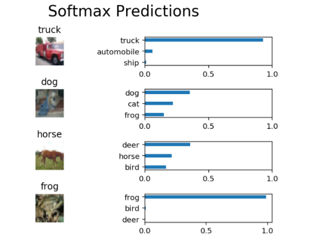

### Image Classification

In this project, I classified images from the <a href="https://www.cs.toronto.edu/~kriz/cifar.html">CIFAR-10</a> dataset. The dataset consists of airplanes, dogs, cats, and other objects. The dataset needed to be preprocessed, then I trained a convolutional neural network on all the samples. I normalized the images, one-hot encoded the labels, built a convolutional layer, max pool layer, and fully connected layer.

